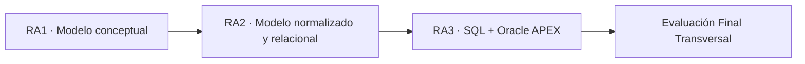

# BDY1101-005D · Base de Datos Aplicada I · 2026-2

Repositorio oficial de apoyo para la sección **BDY1101-005D** del período académico **2026-2**.

## Información general

- **Asignatura:** BDY1101 · Base de Datos Aplicada I
- **Sección:** 005D
- **Período:** 2026-2
- **Docente:** Carlos Martínez Sánchez
- **Sede:** Duoc UC · San Joaquín
- **Modalidad:** Presencial
- **Línea formativa:** Base de Datos
- **Créditos Duoc:** 10
- **SCT:** 4
- **Horario docente vigente:** martes, 16:41–18:50, 3 bloques, sala SJ-L3
- **Inicio para esta sección con el docente:** 8 de septiembre de 2026

## Acceso rápido

- [`semanas/`](semanas/) — organización cronológica del semestre. El mapeo oficial semana ↔ actividad queda pendiente hasta recibir el cronograma institucional.
- [`docs/`](docs/) — conocimiento canónico de la asignatura: PDA, resultados de aprendizaje y ruta de aprendizaje.
- [`labs/`](labs/) — laboratorios prácticos reproducibles y evidencia de trabajo.
- [`ejercicios/`](ejercicios/) — ejercicios, talleres y desafíos complementarios.
- [`evaluaciones/`](evaluaciones/) — estructura de evaluaciones, ponderaciones y preparación.
- [`recursos/`](recursos/) — material complementario y referencias.
- [`site/`](site/) — fuente mantenible del portal web del curso.
- [**Sitio del curso**](https://cmartinezs.github.io/BDY1101-005D-BASE-DE-DATOS-APLICADA-I-2026-2/) — publicación derivada desde `gh-pages`.
- [**Carpeta institucional en Google Drive**](https://drive.google.com/drive/folders/1GdyNuuQGKXWfE2VsyJhq5UGUFoaWPb4M) — material fuente recibido para la asignatura.

## Propósito de la asignatura

Base de Datos Aplicada I busca que el estudiante adquiera habilidades fundamentales para **diseñar e implementar bases de datos relacionales**. La progresión curricular parte desde el modelamiento conceptual, continúa con normalización y modelo relacional, y culmina con implementación SQL y construcción de visualizaciones en Oracle APEX.



## Resultados de aprendizaje

### RA1 · Modelamiento conceptual

Construye un modelo conceptual de datos para representar la información de acuerdo con los requerimientos planteados.

Indicadores principales:

- entidades fuertes y débiles;
- atributos opcionales y obligatorios;
- identificadores únicos;
- relaciones y cardinalidades;
- elementos de Modelo Entidad Relación Extendido.

### RA2 · Modelamiento normalizado y relacional

Construye un modelo de datos aplicando conceptos avanzados de modelamiento para implementarlo en una base de datos relacional.

Indicadores principales:

- normalización para reducir redundancia;
- relaciones/tablas y columnas;
- claves primarias;
- claves foráneas.

### RA3 · Implementación SQL y APEX

Construye sentencias SQL para implementar un modelo relacional, poblar tablas y recuperar información básica.

Indicadores principales:

- DDL para tablas, columnas y constraints;
- inserción de datos y uso de secuencias;
- consultas y recuperación de datos;
- filtros, ordenamiento y operadores;
- dashboard en Oracle APEX basado en consultas SQL.

→ [Detalle de resultados e indicadores](docs/RESULTADOS-DE-APRENDIZAJE.md)

## Experiencias de aprendizaje

La ruta oficial se organiza en tres experiencias.

### EA1 · Construyendo un modelo conceptual de datos

1. **Act. 1.1** · Introducción a las bases de datos y elementos de un modelo conceptual.
2. **Act. 1.2** · Identificando atributos de las entidades.
3. **Act. 1.3** · Relacionando las entidades del modelo.
4. **Act. 1.4** · Extendiendo el modelo.
5. **Evaluación Formativa 1** · Relacionando entidades y extendiendo el modelo conceptual.
6. **Evaluación Parcial 1** · Diseñando el Modelo.

### EA2 · Construyendo un modelo de datos normalizado

1. **Act. 2.1** · Construyendo un MER normalizado.
2. **Act. 2.2** · Construyendo un MR normalizado.
3. **Act. 2.3** · Conociendo y usando APEX.
4. **Evaluación Formativa 2** · Construcción de MER Normalizado.
5. **Evaluación Parcial 2** · MER Normalizado, Modelo Relacional e informes interactivos con formulario en Oracle APEX.

### EA3 · Construyendo sentencias SQL para crear, poblar y ver datos

1. **Act. 3.1** · Conociendo SQL. Gestión de tablas.
2. **Act. 3.2** · Poblando tablas de la base de datos.
3. **Act. 3.3** · Visualización, alias, operaciones matemáticas y ordenamiento.
4. **Act. 3.4** · Restricciones en la visualización de datos.
5. **Act. 3.5** · Dashboard en APEX.
6. **Evaluación Formativa 3** · Consultas SQL.
7. **Evaluación Parcial 3** · Consultas SQL y Creación de Dashboard.
8. **Evaluación Final Transversal**.

→ [Ruta de aprendizaje completa](docs/RUTA-DE-APRENDIZAJE.md)

## Evaluaciones

La nota final se compone de:

- **60% evaluaciones parciales**;
- **40% Evaluación Final Transversal**.

Dentro del componente parcial:

| Evaluación | Peso dentro de evaluaciones parciales |
| --- | ---: |
| Evaluación Parcial 1 · Diseñando el Modelo | 30% |
| Evaluación Parcial 2 · MER Normalizado + Modelo Relacional + APEX | 40% |
| Evaluación Parcial 3 · Consultas SQL + Dashboard | 30% |

→ [Detalle de evaluaciones](evaluaciones/README.md)

## Material institucional recibido

La carpeta `PDA` del Drive institucional contiene:

- el PDA oficial de BDY1101;
- carpetas completas para EA1, EA2 y EA3;
- presentaciones, talleres, quizzes y otros recursos asociados a las actividades.

Por ejemplo, la **Actividad 1.1** ya contiene material de introducción a bases de datos, elementos de un modelo conceptual, talleres de reconocimiento de información e identificación de entidades, además de un quiz.

El repositorio **no copia automáticamente archivos institucionales ni temporales**. Se incorpora conocimiento derivado y material docente cuando corresponde, manteniendo Drive como fuente de archivos originales.

## Cronograma

**Estado: pendiente de recepción.**

El PDA define experiencias, actividades, indicadores y horas pedagógicas, pero no reemplaza el cronograma oficial del semestre. Por esa razón:

- no se inventarán fechas de actividades o evaluaciones;
- `semanas/` queda preparado para recibir la planificación cronológica real;
- cuando llegue el cronograma se conciliará `semana ↔ actividad ↔ RA/IL ↔ evaluación`.

→ [Estado del cronograma](semanas/README.md)

## Regla de organización pedagógica

```text
PDA / RA / IL
→ experiencia de aprendizaje
→ actividad
→ explicación docente
→ ejercicio o laboratorio
→ evidencia
→ evaluación cuando corresponda
```

`docs/` mantiene la estructura académica canónica. `semanas/` será la vista temporal cuando el cronograma esté disponible. `labs/`, `ejercicios/` y `evaluaciones/` contienen las prácticas y artefactos específicos sin duplicar innecesariamente el contenido curricular.

## Publicación web

La fuente mantenible vive en `site/`.

La publicación usa:

```text
GitHub Pages
→ Deploy from a branch
→ gh-pages
→ / (root)
```

La rama `gh-pages` es una superficie derivada; el conocimiento académico se mantiene primero en `master` y luego se refleja en el sitio.

---

> AVA y los canales institucionales continúan siendo la fuente oficial para comunicaciones, instrucciones de evaluación y material que Duoc UC determine gestionar dentro de sus plataformas.