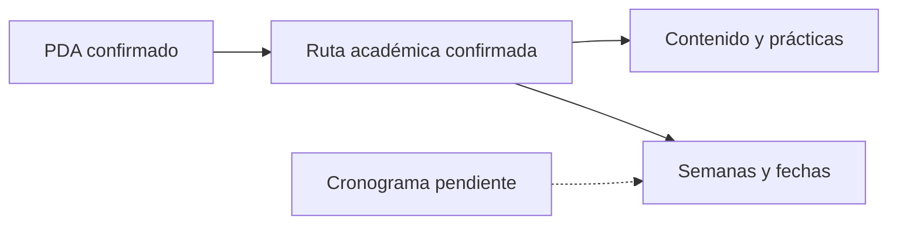

# PDA · Resumen canónico

## Identificación

- **Sigla:** BDY1101
- **Nombre:** Base de Datos Aplicada I
- **Formato:** Presencial
- **Línea formativa:** Base de Datos
- **SCT:** 4
- **Créditos Duoc:** 10
- **Prerrequisitos:** N/A

## Propósito

La asignatura está orientada al diseño e implementación de bases de datos relacionales. La progresión parte por modelamiento conceptual, continúa con normalización y modelo relacional, y finaliza con implementación SQL, recuperación de información y construcción de dashboards en Oracle APEX.

## Resultados de aprendizaje

1. **RA1:** construir un modelo conceptual de datos.
2. **RA2:** construir un modelo de datos normalizado y relacional.
3. **RA3:** construir sentencias SQL e implementar visualización básica mediante Oracle APEX.

→ Ver [`RESULTADOS-DE-APRENDIZAJE.md`](RESULTADOS-DE-APRENDIZAJE.md).

## Experiencias de aprendizaje

El PDA define tres experiencias:

- **EA1:** Construyendo un modelo conceptual de datos.
- **EA2:** Construyendo un modelo de datos normalizado.
- **EA3:** Construyendo sentencias SQL para crear, poblar y ver datos.

→ Ver [`RUTA-DE-APRENDIZAJE.md`](RUTA-DE-APRENDIZAJE.md).

## Evaluación

La nota final se estructura en:

- **60% evaluaciones parciales**;
- **40% Evaluación Final Transversal**.

Distribución interna de parciales:

- Parcial 1: 30%;
- Parcial 2: 40%;
- Parcial 3: 30%.

## Evaluación Final Transversal

El PDA describe una integración de la ruta completa: modelamiento conceptual, normalización, modelo relacional, script de base de datos, resolución de requerimientos mediante SQL y generación de informes/interacciones en Oracle APEX.

## Ambiente de aprendizaje

Las actividades del PDA se asocian a **TAITE 9 · Taller de Alto Cómputo**.

## Fuente institucional disponible

En Google Drive existe una carpeta `PDA` con:

- PDF oficial de la asignatura;
- EA1 con sus actividades 1.1–1.4;
- EA2 con sus actividades 2.1–2.3;
- EA3 con sus actividades 3.1–3.5;
- presentaciones, talleres, quizzes y archivos de apoyo por actividad.

La carpeta raíz de la asignatura también contiene `PA`, `EFT` y `PIA`, que se revisarán y documentarán cuando corresponda integrarlos al flujo del curso.

## Regla de uso en el repositorio

El PDA es fuente para estructura curricular, RA, IL, experiencias, actividades y evaluaciones. **No se usa para inventar fechas semanales**.

El cronograma oficial sigue pendiente. Hasta recibirlo:

Cuando se reciba el cronograma se realizará conciliación formal entre ruta académica y calendario real.