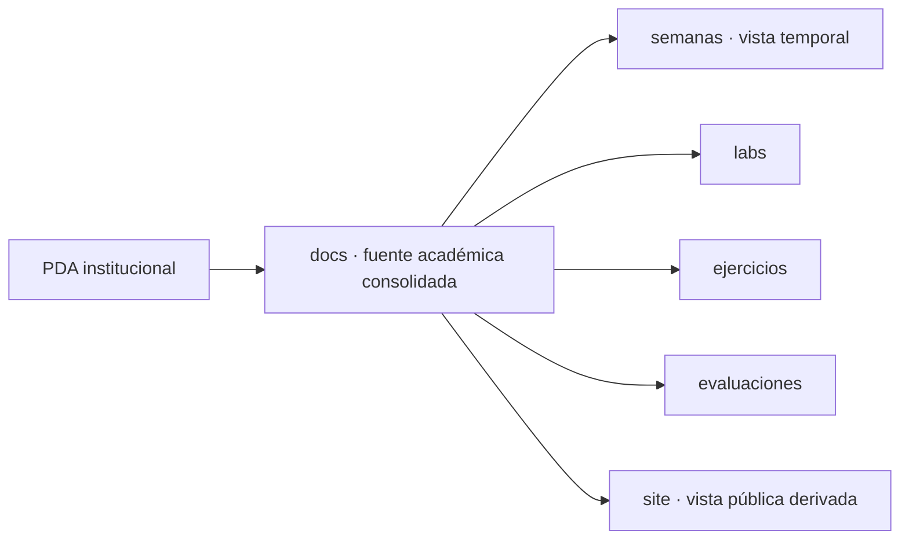

# Documentación académica

Esta carpeta mantiene la fuente de conocimiento académico consolidada de **BDY1101-005D · Base de Datos Aplicada I · 2026-2**.

## Documentos

- [`RESULTADOS-DE-APRENDIZAJE.md`](RESULTADOS-DE-APRENDIZAJE.md) — RA1, RA2, RA3 e indicadores de logro asociados.
- [`RUTA-DE-APRENDIZAJE.md`](RUTA-DE-APRENDIZAJE.md) — experiencias de aprendizaje, actividades, evaluaciones y horas definidas por el PDA.
- [`PDA-RESUMEN.md`](PDA-RESUMEN.md) — síntesis del Plan Didáctico de Aula y decisiones de uso en este repositorio.

## Principio de organización

`docs/` responde **qué debe aprenderse y cómo está estructurado académicamente**.

`semanas/` responderá **cuándo corresponde cada contenido**, una vez recibido el cronograma oficial.

No se inventan fechas ni asignaciones semanales mientras el cronograma oficial esté pendiente.