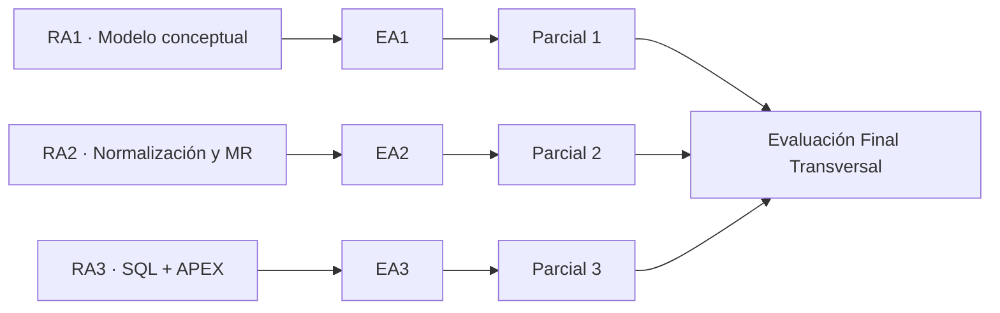

# Resultados de aprendizaje e indicadores de logro

Fuente académica: **PDA · BDY1101 Base de Datos Aplicada I**.

## RA1 · Modelo conceptual de datos

**Resultado de aprendizaje:** construye un modelo conceptual de datos para representar la información, de acuerdo con los requerimientos planteados.

### Indicadores de logro

- **IL 1.1** Representa entidades fuertes y débiles en el modelo conceptual asociadas al problema planteado.
- **IL 1.2** Representa atributos opcionales y obligatorios de las entidades en el modelo conceptual.
- **IL 1.3** Representa identificadores únicos de las entidades.
- **IL 1.4** Representa relaciones y cardinalidad entre entidades.
- **IL 1.5** Representa relaciones propias del Modelo Entidad Relación Extendido.

## RA2 · Modelo de datos normalizado y relacional

**Resultado de aprendizaje:** construye un modelo de datos considerando conceptos avanzados de modelamiento para ser implementado en una base de datos relacional.

### Indicadores de logro

- **IL 2.1** Aplica normalización en el modelo conceptual para eliminar redundancia.
- **IL 2.2** Representa relaciones/tablas y columnas en el modelo relacional normalizado.
- **IL 2.3** Representa claves primarias.
- **IL 2.4** Representa claves foráneas entre relaciones.

## RA3 · Implementación SQL y Oracle APEX

**Resultado de aprendizaje:** construye sentencias SQL para implementar un modelo relacional, poblar tablas y obtener información básica de acuerdo con los requerimientos planteados.

### Indicadores de logro

- **IL 3.1** Construye sentencias SQL para creación de tablas y columnas aplicando reglas de restricción.
- **IL 3.2** Construye constraints en columnas y tablas según convenciones SQL.
- **IL 3.3** Construye sentencias de inserción de datos usando secuencias para poblar tablas.
- **IL 3.4** Construye sentencias de recuperación de datos con cláusulas de restricción y ordenamiento.
- **IL 3.5** Utiliza operadores lógicos, de comparación y matemáticos en consultas SQL.
- **IL 3.6** Genera dashboard en Oracle APEX con gráficos basados en consultas SQL.

## Trazabilidad

La relación exacta con semanas calendario será incorporada cuando esté disponible el cronograma oficial.