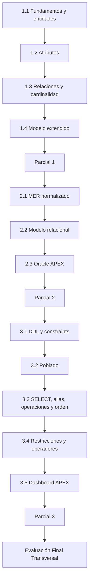

# Ruta de aprendizaje · BDY1101

Esta ruta consolida las experiencias, actividades y evaluaciones descritas por el PDA institucional.

## EA1 · Construyendo un modelo conceptual de datos

Objetivo: desarrollar las competencias necesarias para identificar entidades, atributos, identificadores, relaciones, cardinalidades y extensiones del modelo conceptual.

| Elemento | IL | Horas PDA |
| --- | --- | ---: |
| Act. 1.1 · Introducción a las bases de datos y elementos de un modelo conceptual | IL 1.1 | 5 |
| Act. 1.2 · Identificando atributos de las entidades | IL 1.2 | 5 |
| Act. 1.3 · Relacionando las entidades del modelo | IL 1.3, IL 1.4 | 5 |
| Act. 1.4 · Extendiendo el modelo | IL 1.5 | 5 |
| Evaluación Formativa 1 · Relacionando entidades y extendiendo el modelo conceptual | IL 1.1–1.3 | 0 |
| Evaluación Parcial 1 · Diseñando el Modelo | IL 1.1–1.5 | 5 |

El PDA describe esta experiencia como una instancia práctica basada en casos y talleres. La documentación institucional indica 35 horas presenciales y 16 horas de trabajo autónomo para la experiencia completa.

### Material institucional detectado

La carpeta PDA/EA1 está organizada en cuatro actividades. En **Actividad 1.1** existen, entre otros recursos:

- presentación de introducción a las bases de datos;
- presentación sobre elementos de un modelo conceptual;
- taller de reconocimiento de información;
- taller de identificación de entidades;
- quiz de base de datos y entidades.

## EA2 · Construyendo un modelo de datos normalizado

Objetivo: transformar el modelo conceptual hacia estructuras normalizadas y un modelo relacional implementable.

| Elemento | IL | Horas PDA |
| --- | --- | ---: |
| Act. 2.1 · Construyendo un MER normalizado | IL 2.1, IL 2.2 | 10 |
| Act. 2.2 · Construyendo un MR normalizado | IL 2.3, IL 2.4 | 10 |
| Act. 2.3 · Conociendo y usando APEX | IL 2.1 | 5 |
| Evaluación Formativa 2 · Construcción de MER Normalizado | IL 2.1–2.3 | 0 |
| Evaluación Parcial 2 · MER Normalizado, Modelo Relacional e informes interactivos con formulario en Oracle APEX | IL 2.1–2.4 | 5 |

## EA3 · Construyendo sentencias SQL para crear, poblar y ver datos

Objetivo: implementar el modelo relacional, poblarlo, consultar información y presentar resultados mediante Oracle APEX.

| Elemento | IL | Horas PDA |
| --- | --- | ---: |
| Act. 3.1 · Conociendo SQL. Gestión de tablas | IL 3.1, IL 3.2 | 5 |
| Act. 3.2 · Poblando tablas de la base de datos | IL 3.3 | 5 |
| Act. 3.3 · Visualización, alias, operaciones matemáticas y ordenamiento | IL 3.4 | 5 |
| Act. 3.4 · Restricciones en la visualización de datos | IL 3.5 | 5 |
| Act. 3.5 · Dashboard en APEX | IL 3.6 | 5 |
| Evaluación Formativa 3 · Consultas SQL | IL 3.1–3.6 | 0 |
| Evaluación Parcial 3 · Consultas SQL y Creación de Dashboard | IL 3.1–3.6 | 5 |
| Evaluación Final Transversal | RA1 + RA2 + RA3 | 5 |

## Secuencia conceptual



## Estado del mapeo temporal

El orden académico está confirmado por PDA. **Las semanas específicas no se asignan todavía**, porque falta el cronograma oficial del período.

Cuando se reciba, esta ruta se complementará con una matriz:

```text
semana
→ experiencia
→ actividad
→ RA / IL
→ recursos
→ práctica
→ evaluación / checkpoint
```

Hasta ese momento, cualquier fecha distinta al horario regular debe considerarse no confirmada.