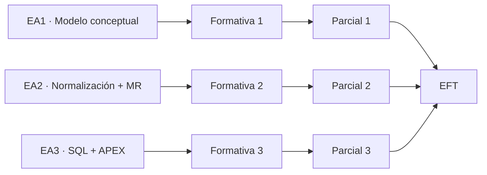

# Evaluaciones · BDY1101-005D

## Estructura de nota final

La asignatura considera:

- **60% evaluaciones parciales**;
- **40% Evaluación Final Transversal (EFT)**.

## Evaluaciones parciales

| Evaluación | Situación evaluativa | Peso dentro del componente parcial |
| --- | --- | ---: |
| **Parcial 1 · Diseñando el Modelo** | Ejecución práctica sin presentación | 30% |
| **Parcial 2 · Construcción de MER Normalizado, Modelo Relacional e informes interactivos con formulario en Oracle APEX** | Ejecución práctica sin presentación | 40% |
| **Parcial 3 · Consultas SQL y Creación de Dashboard** | Ejecución práctica sin presentación | 30% |

El conjunto de parciales aporta el **60% de la nota final**.

## Evaluación Final Transversal

La EFT aporta el **40% de la nota final**.

El PDA la plantea como integración de las competencias desarrolladas durante el semestre. El estudiante debe demostrar, de forma articulada, capacidad para:

1. construir un Modelo Entidad Relación;
2. normalizar el modelo;
3. generar el modelo relacional;
4. construir el script de base de datos;
5. responder requerimientos mediante consultas SQL;
6. desarrollar componentes de visualización/interacción en Oracle APEX.

## Evaluaciones formativas

Cada experiencia contempla una evaluación formativa previa a su parcial:

- **EF1:** Relacionando entidades y extendiendo el modelo conceptual.
- **EF2:** Construcción de MER Normalizado.
- **EF3:** Consultas SQL.

Las evaluaciones formativas no tienen peso directo indicado en la ponderación final del PDA; cumplen función de preparación, retroalimentación y evidencia de progreso.

## Relación con experiencias

## Fechas

**Pendientes del cronograma oficial.**

No se registrarán semanas ni fechas específicas de evaluaciones hasta recibir y conciliar el cronograma institucional.

Cuando esté disponible se documentará aquí y en `semanas/`, evitando mantener calendarios paralelos inconsistentes.