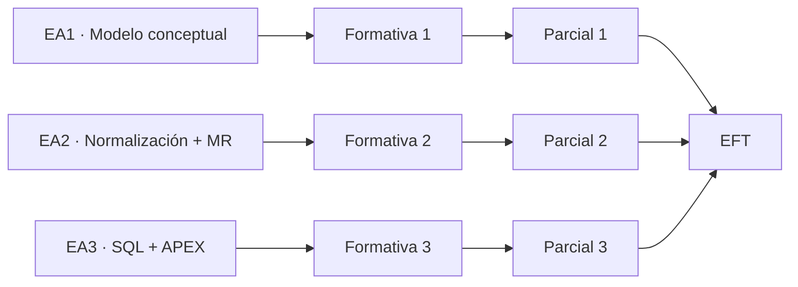

# Evaluaciones · BDY1101-005D

## Estructura de nota final

La asignatura considera:

- **60% evaluaciones parciales**;
- **40% Evaluación Final Transversal (EFT)**.

## Evaluaciones parciales

| Evaluación | Situación evaluativa | Peso dentro del componente parcial | Cronograma institucional |
| --- | --- | ---: | --- |
| **Parcial 1 · Construcción de MER** | Ejecución práctica sin presentación | 30% | Semana 5 · 07-09-2026 a 12-09-2026 |
| **Parcial 2 · Construcción de MER Normalizado, Modelo Relacional e informes interactivos con formulario en Oracle APEX** | Ejecución práctica sin presentación | 40% | Semana 10 · 12-10-2026 a 17-10-2026 |
| **Parcial 3 · Consultas SQL y Creación de Dashboard** | Ejecución práctica sin presentación | 30% | Semana 17 · 30-11-2026 a 05-12-2026 |

El conjunto de parciales aporta el **60% de la nota final**.

### Parcial 1 · estado y contrato oficial

La EP1 evalúa el cierre de **RA1 · Modelamiento conceptual** mediante una ejecución práctica individual de **5 horas pedagógicas** en Oracle SQL Developer Data Modeler.

Los cinco indicadores del RA1 tienen igual ponderación dentro de la evaluación:

- entidades fuertes y débiles — 20%;
- atributos opcionales y obligatorios — 20%;
- identificadores únicos — 20%;
- relaciones y cardinalidades — 20%;
- Modelo Entidad Relación Extendido (MERE) — 20%.

La entrega oficial se realiza vía AVA e incluye el proyecto comprimido del modelador y un documento Word de respaldo con la imagen del MER.

→ [Contrato, alcance y trazabilidad de Evaluación Parcial 1](parcial-1/README.md)

### Regularización de la sección 005D

El docente reemplazante asumió la sección desde el **8 de septiembre de 2026**, por lo que la ejecución real de la asignatura presenta un desfase respecto del cronograma institucional base.

La EP1, originalmente programada para semana 5, se aplica durante la semana siguiente como parte de la regularización. Este desfase **no modifica RA, IL, IE, ponderaciones ni alcance técnico de la evaluación**.

La secuencia de recuperación es:

```text
cierre de RA1
→ EP1
→ transición a RA2
→ normalización
```

## Evaluación Final Transversal

La EFT aporta el **40% de la nota final**.

El PDA la plantea como integración de las competencias desarrolladas durante el semestre. El estudiante debe demostrar, de forma articulada, capacidad para:

1. construir un Modelo Entidad Relación;
2. normalizar el modelo;
3. generar el modelo relacional;
4. construir el script de base de datos;
5. responder requerimientos mediante consultas SQL;
6. desarrollar componentes de visualización/interacción en Oracle APEX.

## Evaluaciones formativas

Cada experiencia contempla una evaluación formativa previa a su parcial:

- **EF1:** Relacionando entidades y extendiendo el modelo conceptual.
- **EF2:** Construcción de MER Normalizado.
- **EF3:** Consultas SQL.

Las evaluaciones formativas no tienen peso directo indicado en la ponderación final del PDA; cumplen función de preparación, retroalimentación y evidencia de progreso.

## Relación con experiencias



## Regla de publicación

Los metadatos, criterios y material pedagógico pueden mantenerse en este repositorio público. Los **enunciados activos**, anexos de evaluación y **soluciones de referencia** no se publican aquí mientras una evaluación se encuentre en aplicación; AVA conserva la autoridad operacional para su distribución y recepción.
