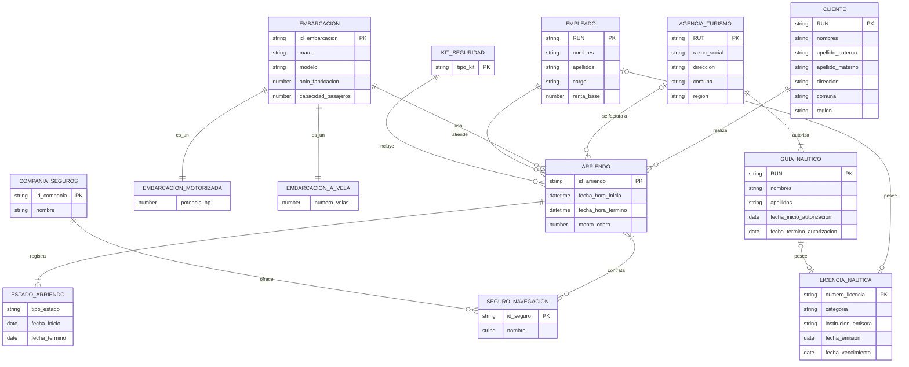

# Pauta de solución — Evaluación Parcial N°1 (Forma B): MER "OceanRent"

> **Nota:** Este documento es una propuesta de solución de referencia construida a partir del caso de negocio y las instrucciones entregadas

## 1. Entidades y atributos

| Entidad | Tipo | Identificador (PK) | Atributos | Observaciones |
|---|---|---|---|---|
| **Embarcación** | Fuerte (supertipo) | id_embarcación | marca, modelo, año_fabricación *(opcional)*, capacidad_pasajeros, veces_utilizada | Año de fabricación es opcional: "de algunas embarcaciones antiguas no se conoce su año de fabricación" |
| **Embarcación_Motorizada** | Subtipo | (hereda de Embarcación) | potencia_motor_hp | Subtipo excluyente con A_Vela |
| **Embarcación_A_Vela** | Subtipo | (hereda de Embarcación) | número_velas | Subtipo excluyente con Motorizada |
| **Cliente** | Fuerte | RUN | nombres, apellido_paterno, apellido_materno, dirección, comuna, región, teléfonos *(multivaluado)* | Restricción "mayor de 18 años" — regla de negocio, no atributo |
| **Agencia_Turismo** | Fuerte | RUT | razón_social, dirección, comuna, región, teléfonos *(multivaluado)* | |
| **Guía_Náutico** | Fuerte | RUN | nombres, apellidos, fecha_inicio_autorización, fecha_término_autorización | Vinculado a una sola agencia a la vez |
| **Empleado** | Fuerte | RUN *(supuesto — no se explicita PK en el enunciado)* | nombres, apellido_paterno, apellido_materno, dirección, comuna, región, teléfonos, correo, cargo, renta_base, indicador_comisión, descuento_salud, descuento_previsión, asignación_movilización | "Cargo" es atributo (patrón de nave, guía náutico, ejecutivo de reservas, gerencia, etc.), no subtipo |
| **Licencia_Náutica** | Fuerte | número_licencia | categoría (I/II/III), institución_emisora, fecha_emisión, fecha_vencimiento | Pertenece a un patrón de nave (Empleado) o a un Guía_Náutico — restricción exclusiva (ver MERE) |
| **Compañía_Seguros** | Fuerte | id_compañía | nombre | Implícita: "provisto por diferentes compañías de seguros" |
| **Seguro_Navegación** | Fuerte | id_seguro | tipo/nombre | N:1 con Compañía_Seguros |
| **Kit_Seguridad** | Catálogo/Fuerte | tipo_kit | descripción | Dominio cerrado: básico, medio, full |
| **Arriendo** | Fuerte | id_arriendo | fecha_hora_inicio, fecha_hora_término, nivel_combustible_retiro *(opc., solo motorizadas)*, estado_velas_retiro *(opc., solo a vela)*, estado_final_devolución, monto_cobro | |
| **Estado_Arriendo** | **Débil** | (id_arriendo + fecha_inicio_estado) | tipo_estado (Pendiente/Confirmado/En navegación/Finalizado/Cancelado), fecha_inicio, fecha_término | Depende existencialmente de Arriendo — permite el historial completo de estados |

## 2. Relaciones y cardinalidades

| Relación | Entidad A (cardinalidad) | Entidad B (cardinalidad) | Descripción |
|---|---|---|---|
| realiza | Cliente (0,N) | Arriendo (1,1) | Un cliente puede tener 0 o muchos arriendos; todo arriendo tiene exactamente 1 cliente |
| se_factura_a | Agencia_Turismo (0,N) | Arriendo (0,1) | Relación **opcional**: si el cliente indica agencia, se factura a ella |
| autoriza | Agencia_Turismo (1,N) | Guía_Náutico (1,1) | Toda agencia tiene ≥1 guía; todo guía pertenece a una sola agencia a la vez |
| usa | Embarcación (0,N) | Arriendo (1,1) | Toda embarcación puede tener 0 o muchos arriendos; cada arriendo usa 1 embarcación |
| atiende | Empleado (0,N) | Arriendo (1,1) | El patrón de nave asignado; cada arriendo tiene exactamente 1 empleado asignado |
| incluye | Kit_Seguridad (0,N) | Arriendo (1,1) | Cada arriendo indica exactamente 1 kit |
| contrata | Arriendo (1,N) | Seguro_Navegación (0,N) | **N:M** — el arriendo exige mínimo 1 seguro, puede tener varios |
| ofrece | Compañía_Seguros (1,N) | Seguro_Navegación (1,1) | Cada seguro pertenece a una compañía |
| registra_historial | Arriendo (1,1) | Estado_Arriendo (1,N) | Relación identificadora (entidad débil) |
| posee_licencia | Empleado — rol patrón de nave (0,1) | Licencia_Náutica (1,1) | Restricción de arco (XOR) con la siguiente |
| posee_licencia | Guía_Náutico (0,1) | Licencia_Náutica (1,1) | Una licencia pertenece a un patrón de nave **o** a un guía náutico, nunca ambos |

## 3. Elementos del Modelo Entidad-Relación Extendido (MERE)

- **Especialización/Generalización total y disjunta**: Embarcación → {Embarcación_Motorizada, Embarcación_A_Vela}. Total porque toda embarcación es de un tipo u otro ("se clasifican en Motorizadas y A vela"); disjunta porque una embarcación no puede ser ambas a la vez.
- **Restricción de arco (OR exclusivo)** entre las relaciones Empleado–Licencia_Náutica y Guía_Náutico–Licencia_Náutica: una licencia náutica siempre pertenece a un único titular, sea este un empleado (patrón de nave) o un guía náutico externo, nunca a ambos simultáneamente.
- **Atributo opcional**: año_fabricación en Embarcación.
- **Atributo multivaluado**: teléfonos en Cliente y en Agencia_Turismo.

## 4. Diagrama conceptual (notación simplificada)

*(Las relaciones `es_un` representan la especialización total y disjunta; Mermaid no tiene notación nativa de ISA, así que en el modelo real de Oracle Data Modeler esto se dibuja como una jerarquía de subtipos, no como una relación normal.)*

## 5. Puntos de atención para la corrección (según tabla de especificaciones)

| Indicador | Qué revisar en la entrega del estudiante |
|---|---|
| IL/IE 1.1 — entidades fuertes y débiles | ¿Identificó Estado_Arriendo (o equivalente) como entidad débil dependiente de Arriendo? |
| IL/IE 1.2 — atributos opcionales/obligatorios | ¿Marcó año_fabricación como opcional? ¿Los atributos de facturación/combustible-velas quedaron coherentes con el tipo de embarcación? |
| IL/IE 1.3 — identificadores únicos | ¿RUN/RUT como PK de Cliente/Agencia/Guía/Empleado? ¿Identificador correcto para la entidad débil (dependiente de Arriendo)? |
| IL/IE 1.4 — relaciones y cardinalidad | ¿Cardinalidad opcional correcta entre Arriendo y Agencia (0,1)? ¿N:M entre Arriendo y Seguro? ¿Agencia (1,N)–Guía (1,1)? |
| IL/IE 1.5 — relaciones MERE | ¿Especialización Embarcación → Motorizada/A vela (total y disjunta)? ¿Alguna forma de resolver que la licencia pertenece a un patrón de nave o a un guía náutico, no a ambos? |

